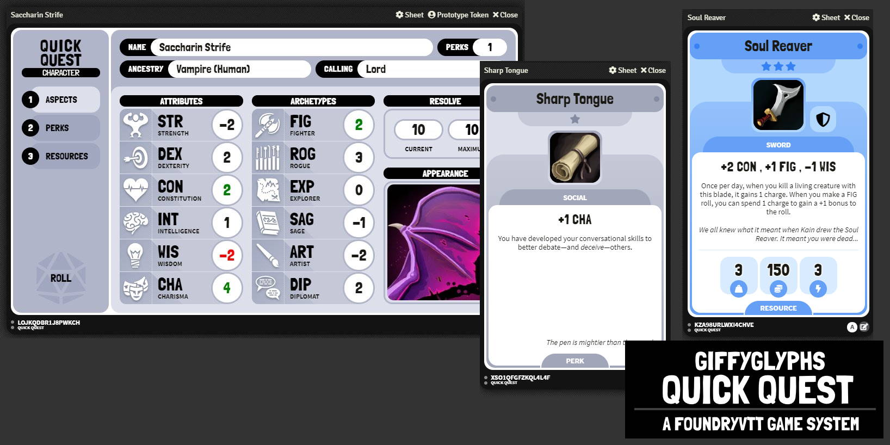

# Changelog

## v1.0.0
* Ajouté la feuille de personnage et les dialogues/options de jet.
* Gestion du D100
* Ajout de l'inventaire ressources.
* Ajout des compétences.
* Ajout du suport du module Token Action HUD
* Ajout de plusieurs types d'acteur (Sans fiche de perso)
* Création des compétences de base / spécifiques
* Ajout d'un système de monnaie
* Ajout d'un système de point d'inspiration
* Ajout de la gestion des macros & des rolls depuis la fiche de personnages
* Ajout d'un systeme de tri par nom A - Z & Z - A via le nom de l'objet dans l'inventaire ou des compétences
