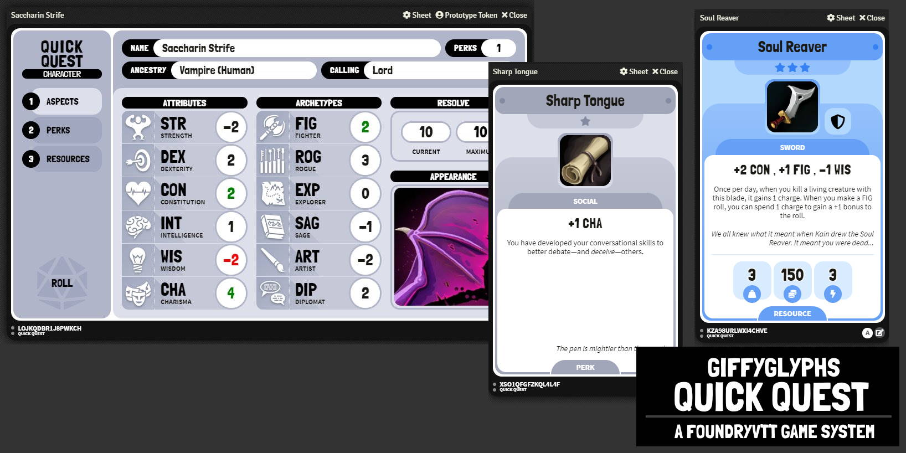
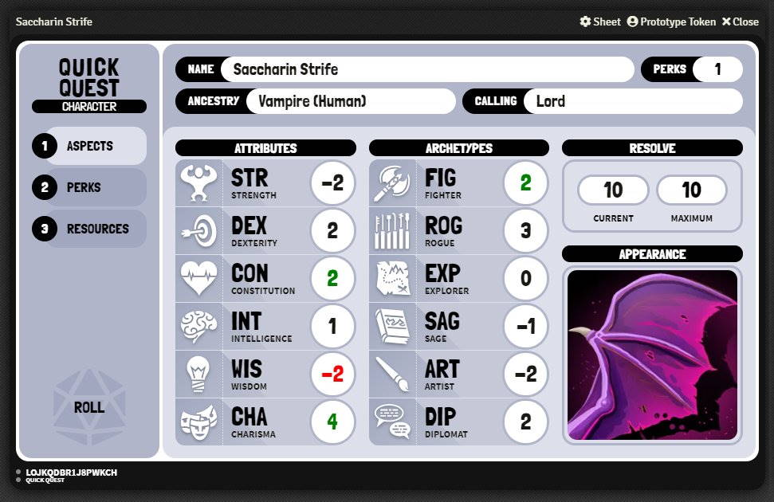
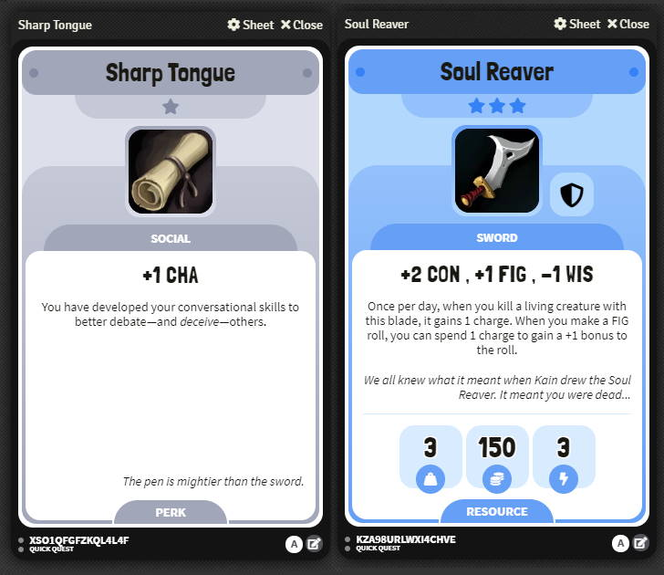

# LVDD - Quête Rapide

Vous cherchez un systeme D100 simple, rapide et efficace pour vos parties de JDR sur [Foundry VTT](https://foundryvtt.com/)?

Pas d'inquiétude**LVDD - Quête rapide** est là ! 

Commencez à jouer à un jeu de rôle facile à prendre en main en quelques minutes grâce à une feuille de personnage simple, du d100 et une gestion de compétences et d'inventaire bien pensée.

* Installer le système : https://raw.githubusercontent.com/hakimassouane/lvdd-quete-rapide/master/system.json
* [Lire le Changelog](https://github.com/hakimassouane/lvdd-quete-rapide/blob/master/docs/CHANGELOG.md) 

## Fonctionnalités

* Une feuille de personnage complète.
* Des objets et des compétences avec 5 niveaux de rareté : commun, peu commun, rare, épique et légendaire.
* Des méchanismes de jet super rapide avec du D100

## Pour commencer

1. Installer et activer le système.
   * URL du système: https://raw.githubusercontent.com/hakimassouane/lvdd-quete-rapide/master/system.json
2. Créez un nouvel **Acteur**. Personnalisez votre acteur en définissant ses attributs et ses archétypes.
3. Créez un nouvel **Objet**. Personnalisez-le et faites-le glisser sur votre acteur.
4. Créez une nouvelle **Compétence**. Personnalisez-la et faites-la glisser sur votre acteur.

## Licences

Ce module est sous licence de la [Foundry Virtual Tabletop EULA: Limited License Agreement for module development](https://foundryvtt.com/article/license/).
